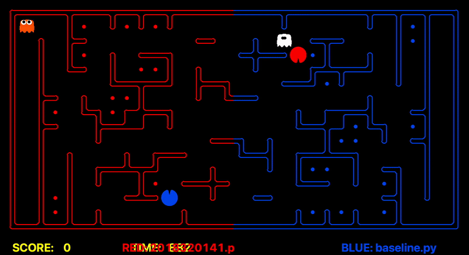

## PACMAN AI - Artificial Intelligence (COSE36103) course of Korea University



This is repository for PACMAN AI project for Articifial Intelligence 2022 course (COSE36103) of Korea University. I got A<sup>+</sup> in this course 👍🏻. If you are interested, check out the report `2018320141.pdf` uploaded in this repository. English version will be coming soon. 

### 🎮 How to run pacman?

If you run command below, Pacman AI implemented in 2018320141.py will be compared with every baseline for 10 times each.

```
python capture.py 2018320141.py -n 10
```

You can determine red team and blue team with -r, -b argument like below:

```
python capture.py -r your_baseline.py -b your_baseline2.py
```
